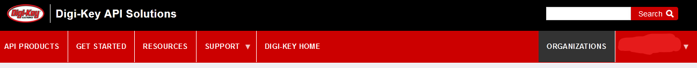

# How To

1. Register/login for digikey API: [https://developer.digikey.com/](https://developer.digikey.com/)
2. Go to organizations tab:

    

    (we're going to skip making a sandbox version of the app)

3. Create new organization
4. Click Production Apps next to your new organization 

    

5. Create Production App
6. Fill in the details, paying special attention to the following:
    - **Name** - doesn't matter
    - **OAuth Callback** - [`https://localhost`](https://localhost/)
    - **Description** - doesn't matter
    - Select at least the following:

        

7. Click add production app
8. Next screen should look like what's shown below. Click the app name (circled)

    

9. Open the `barcode_scan.py` file in a text editor and copy and paste the your Client ID (`BBB`) and Client Secret (`CCC`) from your app credentials into their respective fields:

    (note: you wont have a value for `code` yet)

        app_credentials= {
            'code': 'AAA',
            'client_id': "BBB",
            'client_secret': "CCC",
            'mouser_key': "DDD"
        }

10. Now ensure you have the necessary python3 libraries:

    Windows Powershell, Linux, & MacOS:

        pip3 install pyzbar, pylibmtx

    and if you want to use a webcam to scan barcodes:

        pip3 install opencv-python

    (note: your system may use `pip` instead of `pip3`. Either way, just make sure you're installing python3 packages)

11. Save and run the `barcode_scan.py` file using python3 and you will get an error message.

    Windows Powershell:

        PS C:\Users\USER\DEMO_DIRECTORY> python barcode_scan.py

    Linux/MacOS

        USER@DESKTOP:~/DEMO_DIRECTORY$ python barcode_scan.py

    **The error message should look similar to the one below, otherwise, troubleshoot the errors and try again.**

    

12. With a similar error message as shown above, proceed by copying the URL underlined in red. 
13. Open a new tab in your browser and paste the previously copied URL
14. You should be directed to a page that looks like this (you may need to log in). Click "Allow"

    

15. Paste the copied code into the `barcode_scan.py` file replacing the `AAA` term:

        app_credentials= {
            'code': 'AAA',
            'client_id': "BBB",
            'client_secret': "CCC",
            'mouser_key': "DDD"
        }

16. After updating the 3 `app_credential` fields, save the `barcode_scan.py` file and run again.

    (note: the OAuth code is only good for 60 seconds. If you get an error saying the code expired, just navigate to the URL again and repeat the process)

17. A the first successful `barcode_scan.py` should look like this when starting:

    

    Running subsequent `barcode_scan.py` (after the first successful startup) will look like this:

    (you shouldn't need to do the OAuth code any longer)

    

18. If you have a webcam the example script will try and connect.

19. To return detailed product information, change `product_info=False` to `product_info=True`.

## Mouser Setup

Mouser's API is easier to set up but much more limited in its capability.

1. Navigate to https://www.mouser.com/MyMouser/MouserSearchApplication.aspx and register for an API account

2. You'll recieve an email shortly containing an "API Key."

3. Enter the API key into the `DDD` field in barcode_scan.py:

        app_credentials= {
            'code': 'AAA',
            'client_id': "BBB",
            'client_secret': "CCC",
            'mouser_key': "DDD"
        }

